# Atlas System Architecture

Visual representation of the CLAUDE.md system architecture.

## Master Overview

```mermaid
graph TB
    subgraph ATLAS["🤖 ATLAS - Ran.AI Agency Assistant"]
        direction TB

        subgraph ROLES["Executive Roles"]
            CEO["[CEO]<br/>Strategy & Vision"]
            CFO["[CFO]<br/>Finance & Zoho Books"]
            CMO["[CMO]<br/>Marketing & Branding"]
            CTO["[CTO]<br/>Technology & Code"]
            COO["[COO]<br/>Operations & Workflows"]
            EA["[EA]<br/>Executive Assistant"]
        end

        subgraph LAYERS["3-Layer Architecture"]
            L1["Layer 1: DIRECTIVE<br/>📋 SOPs in directives/"]
            L2["Layer 2: ORCHESTRATION<br/>🧠 Decision Making (You)"]
            L3["Layer 3: EXECUTION<br/>⚙️ Python scripts in execution/"]
        end

        L1 --> L2
        L2 --> L3
        L3 -.->|feedback| L2
    end

    style ATLAS fill:#1a1a2e,stroke:#00d9ff,color:#fff
    style ROLES fill:#16213e,stroke:#0f3460,color:#fff
    style LAYERS fill:#0f3460,stroke:#e94560,color:#fff
```

## 3-Layer Architecture Detail

```mermaid
flowchart LR
    subgraph L1["📋 LAYER 1: DIRECTIVE"]
        D1["directives/*.md"]
        D2["Goals & Inputs"]
        D3["Tools to Use"]
        D4["Expected Outputs"]
        D5["Edge Cases"]
    end

    subgraph L2["🧠 LAYER 2: ORCHESTRATION"]
        O1["Read Directives"]
        O2["Call Tools in Order"]
        O3["Handle Errors"]
        O4["Update Directives"]
        O5["Ask Clarification"]
    end

    subgraph L3["⚙️ LAYER 3: EXECUTION"]
        E1["execution/*.py"]
        E2["API Calls"]
        E3["Data Processing"]
        E4["File Operations"]
        E5["Database Interactions"]
    end

    L1 ==> L2
    L2 ==> L3
    L3 -.->|"Results & Errors"| L2
    L2 -.->|"Learnings"| L1

    style L1 fill:#2d3436,stroke:#00b894,color:#fff
    style L2 fill:#2d3436,stroke:#fdcb6e,color:#fff
    style L3 fill:#2d3436,stroke:#e17055,color:#fff
```

## File Organization

```mermaid
graph TD
    subgraph PROJECT["📁 Project Structure"]
        ROOT["Project Root"]

        ROOT --> TMP[".tmp/<br/>🗑️ Intermediate files<br/>(never commit)"]
        ROOT --> EXEC["execution/<br/>🐍 Python scripts"]
        ROOT --> DIR["directives/<br/>📋 SOPs in Markdown"]
        ROOT --> ENV[".env<br/>🔐 API keys & tokens"]
        ROOT --> CREDS["credentials.json<br/>token.json<br/>🔑 Google OAuth"]
        ROOT --> CLAUDE[".claude/<br/>🤖 Custom agents"]
        ROOT --> SPEC["spec/<br/>📝 Implementation plans"]

        subgraph OUTPUTS["☁️ Deliverables"]
            SHEETS["Google Sheets"]
            SLIDES["Google Slides"]
            CLOUD["Other Cloud Services"]
        end
    end

    EXEC -.->|produces| OUTPUTS
    TMP -.->|temporary| EXEC

    style PROJECT fill:#1e272e,stroke:#00d2d3,color:#fff
    style OUTPUTS fill:#0a3d62,stroke:#78e08f,color:#fff
```

## Self-Annealing Loop

```mermaid
flowchart TD
    START["🚨 Error Occurs"] --> FIX["1. Fix the issue"]
    FIX --> UPDATE["2. Update the tool"]
    UPDATE --> TEST["3. Test tool"]
    TEST --> DOC["4. Update directive<br/>with new flow"]
    DOC --> STRONG["5. System is<br/>now stronger 💪"]
    STRONG -.->|"Next error"| START

    style START fill:#c0392b,stroke:#e74c3c,color:#fff
    style STRONG fill:#27ae60,stroke:#2ecc71,color:#fff
```

## Cloud Webhooks (Modal)

```mermaid
flowchart LR
    subgraph TRIGGER["🌐 Event Trigger"]
        HTTP["HTTP Request"]
    end

    subgraph MODAL["☁️ Modal Platform"]
        WH["Webhook Endpoint"]
        MAP["webhooks.json<br/>slug → directive"]
    end

    subgraph EXECUTE["⚡ Execution"]
        DIR["Load Directive"]
        TOOLS["Available Tools:<br/>• send_email<br/>• read_sheet<br/>• update_sheet"]
    end

    subgraph NOTIFY["📢 Notifications"]
        SLACK["Slack Stream<br/>(real-time)"]
    end

    HTTP --> WH
    WH --> MAP
    MAP --> DIR
    DIR --> TOOLS
    TOOLS --> SLACK

    style MODAL fill:#5f27cd,stroke:#341f97,color:#fff
    style NOTIFY fill:#10ac84,stroke:#1dd1a1,color:#fff
```

## Sub-Agents Architecture

## Role-Based Agent Delegation

```mermaid
flowchart LR
    subgraph REQUEST["📥 Incoming Request"]
        R1["Strategy question?"]
        R2["Financial task?"]
        R3["Marketing need?"]
        R4["Technical decision?"]
        R5["Process design?"]
        R6["Admin/scheduling?"]
    end

    subgraph AGENTS["🤖 Delegate to Agent"]
        A1["ceo-strategist<br/>💎 Opus"]
        A2["cfo-financial<br/>⚖️ Sonnet"]
        A3["cmo-marketing<br/>⚖️ Sonnet"]
        A4["cto-technical<br/>💎 Opus"]
        A5["coo-operations<br/>⚖️ Sonnet"]
        A6["ea-assistant<br/>⚡ Haiku"]
    end

    R1 --> A1
    R2 --> A2
    R3 --> A3
    R4 --> A4
    R5 --> A5
    R6 --> A6

    style REQUEST fill:#2d3436,stroke:#636e72,color:#fff
    style AGENTS fill:#0984e3,stroke:#74b9ff,color:#fff
```

## Multi-Role Collaboration

```mermaid
flowchart TD
    subgraph SCENARIO["📋 Example: Launch New Service"]
        TASK["Task: Launch AI Consulting Service"]
    end

    TASK --> CEO["ceo-strategist<br/>Market positioning<br/>Pricing strategy"]
    TASK --> CFO["cfo-financial<br/>Cost analysis<br/>Revenue projections"]
    TASK --> CMO["cmo-marketing<br/>Launch campaign<br/>Content plan"]
    TASK --> CTO["cto-technical<br/>Tech requirements<br/>Tool selection"]
    TASK --> COO["coo-operations<br/>Service delivery SOP<br/>Client onboarding"]

    CEO --> SYNC["🔄 Orchestrator<br/>Synthesizes all inputs"]
    CFO --> SYNC
    CMO --> SYNC
    CTO --> SYNC
    COO --> SYNC

    SYNC --> PLAN["📝 Unified Launch Plan"]

    style SCENARIO fill:#6c5ce7,stroke:#a29bfe,color:#fff
    style SYNC fill:#00b894,stroke:#55efc4,color:#fff
    style PLAN fill:#fdcb6e,stroke:#f39c12,color:#000
```

## Orchestration Workflow

## Model Selection Guide

```mermaid
graph LR
    subgraph MODELS["🎯 Model Selection"]
        OPUS["Opus<br/>💎 Premium"]
        SONNET["Sonnet<br/>⚖️ Balanced"]
        HAIKU["Haiku<br/>⚡ Fast & Cheap"]
    end

    subgraph USECASES["Use Cases"]
        UC1["Planning"]
        UC2["Complex Coding"]
        UC3["General Coding"]
        UC4["Code Review"]
        UC5["Exploration"]
    end

    OPUS --> UC1
    OPUS --> UC2
    SONNET --> UC3
    HAIKU --> UC4
    HAIKU --> UC5

    style OPUS fill:#9b59b6,stroke:#8e44ad,color:#fff
    style SONNET fill:#3498db,stroke:#2980b9,color:#fff
    style HAIKU fill:#2ecc71,stroke:#27ae60,color:#fff
```

## Key Commands Reference

```mermaid
graph TD
    subgraph COMMANDS["⌨️ Key Commands"]
        C1["@agent-name<br/>Tag agent directly"]
        C2["Ctrl+B<br/>Run in background"]
        C3["↓ Arrow<br/>View background tasks"]
        C4["/agents<br/>List & create agents"]
        C5["/context<br/>Check token usage"]
    end

    style COMMANDS fill:#2c3e50,stroke:#34495e,color:#fff
```

## Complete System Flow

```mermaid
flowchart TB
    USER["👤 User Request"] --> ATLAS

    subgraph ATLAS["🤖 ATLAS"]
        ROLE["Select Role<br/>[CEO/CFO/CMO/CTO/COO/EA]"]
        CHECK["Check directives/"]
        DECIDE["Orchestrate Solution"]
    end

    subgraph AGENTS["Sub-Agents"]
        direction LR
        SA1["Plan"]
        SA2["Explore"]
        SA3["Coder"]
        SA4["Reviewer"]
    end

    subgraph EXEC["Execution Layer"]
        PY["Python Scripts"]
        API["API Calls"]
    end

    subgraph OUTPUT["Outputs"]
        CLOUD["☁️ Cloud Deliverables"]
        SLACK2["📢 Slack Notifications"]
    end

    ATLAS --> AGENTS
    AGENTS --> EXEC
    EXEC --> OUTPUT
    OUTPUT --> USER

    ATLAS -.->|"errors"| ANNEAL["🔄 Self-Anneal"]
    ANNEAL -.->|"update"| ATLAS

    style USER fill:#e74c3c,stroke:#c0392b,color:#fff
    style ATLAS fill:#3498db,stroke:#2980b9,color:#fff
    style AGENTS fill:#9b59b6,stroke:#8e44ad,color:#fff
    style EXEC fill:#e67e22,stroke:#d35400,color:#fff
    style OUTPUT fill:#27ae60,stroke:#1e8449,color:#fff
```

---

## Quick Reference Card

| Component | Location | Purpose |
|-----------|----------|---------|
| Directives | `directives/` | SOPs - what to do |
| Scripts | `execution/` | Python tools - how to do it |
| Temp files | `.tmp/` | Intermediate processing |
| Custom agents | `.claude/` | Specialized sub-agents |
| Plans | `spec/` | Implementation blueprints |
| Secrets | `.env` | API keys and tokens |
| Webhooks | `webhooks.json` | Event-driven triggers |

**Core Principle:** Orchestrate, don't execute. Push complexity to deterministic code and specialized agents.
